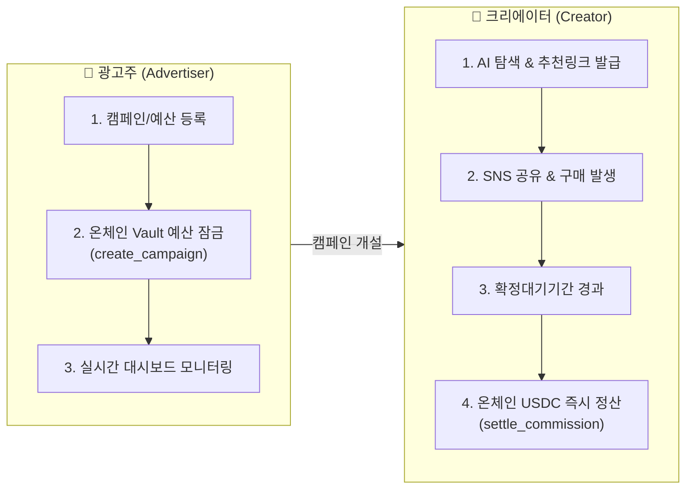
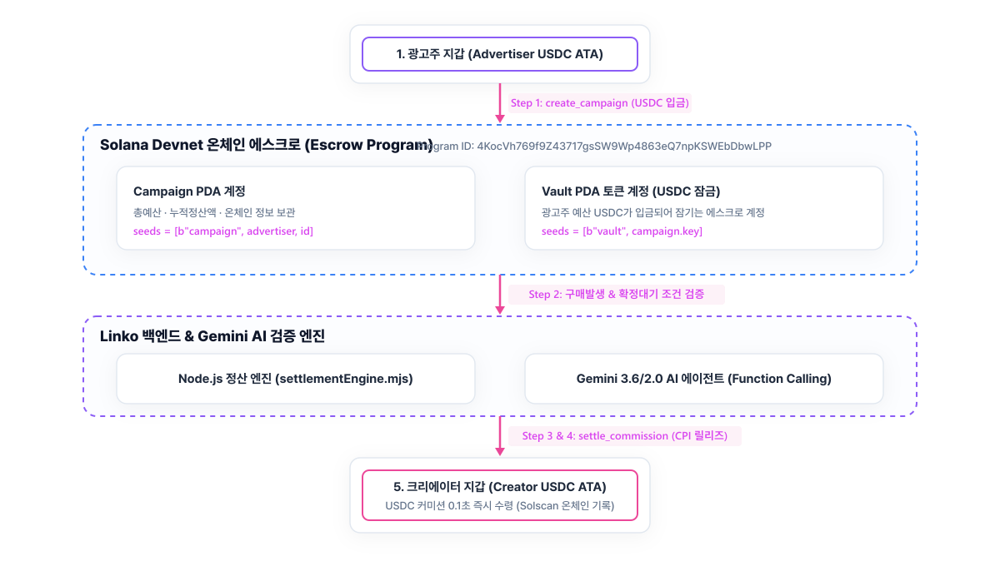

# Linko

판매된 만큼, 그 자리에서 바로 정산받는 성과형 광고 플랫폼

## 개요

Linko는 팔로워 수 제한 없이 누구나 참여할 수 있는 인플루언서 성과형 광고 플랫폼입니다. 광고주가 캠페인과 예산을 등록하면, 크리에이터는 추천 링크로 상품을 홍보하고 판매가 발생시킵니다. 구매확정 대기기간이 지나면 별도 정산일 없이 Solana 온체인 에스크로에서 크리에이터 지갑으로 USDC 커미션이 자동 지급되고, 캠페인 검색·실적 분석·광고 문구 생성은 Gemini 기반 AI 에이전트가 대화형으로 지원합니다.

## Workflow



### 👔 광고주 (Advertiser)
1. **캠페인 등록**: 상품, 가격, 커미션 티어, 확정대기기간, 예산(KRW) 입력
2. **온체인 에스크로 예산 잠금**: 등록된 예산이 USDC로 환산되어 Solana 온체인 에스크로 Vault에 입금·잠김 (`create_campaign`)
3. **성과 모니터링**: 대시보드에서 캠페인별 예산 소진 현황, 크리에이터별 실적 실시간 확인

### 🎨 크리에이터 (Creator)
1. **캠페인 탐색**: 캠페인 목록 조회 또는 AI 에이전트('링코')에게 자연어로 적합한 캠페인 검색 요청
2. **추천 링크 발급**: 원하는 캠페인 참여 → 본인 전용 추천 링크/코드 발급
3. **구매 발생**: 추천 링크 공유 → 구매자 클릭 및 주문 생성 (`purchased`)
4. **자동 확정 & 비율 산출**: 확정대기기간 경과 시 누적 확정 판매 건수 기준으로 커미션 비율 자동 결정
5. **온체인 USDC 자동 정산**: 온체인 에스크로 Vault → 크리에이터 지갑으로 USDC 커미션 자동 릴리즈 (`settle_commission`)
6. **실적 및 온체인 장부 검증**: 대시보드에서 누적 정산액과 Solscan 온체인 트랜잭션 링크 확인

### 🤖 AI 에이전트 ('링코')
- 광고주/크리에이터가 챗봇에 자연어로 질문 → Gemini Function Calling이 백엔드 6개 도구를 자율 호출하여 실적 분석, 수익 시뮬레이션, 광고 카피 작성 지원

## 시스템 구조도 (System Architecture)



```
[1. 광고주 지갑] ➔ [2. 온체인 Vault 예산 잠금] ➔ [3. 구매 발생 및 AI 검증] ➔ [4. 온체인 해제 (Release)] ➔ [5. 크리에이터 지갑]
```

### 📍 온체인 에스크로 & AI 정산 5단계 흐름 상세

#### 1️⃣ 광고주 지갑 (Advertiser Wallet) — 출발점
- 광고주가 브랜드 상품, 예산(예: 1,500,000원 / 약 1,000 USDC), 확정대기기간을 등록하고 캠페인을 생성합니다.
- 광고주의 지갑에서 예산으로 사용할 **USDC 토큰**이 온체인 출발 준비를 합니다.

#### 2️⃣ 온체인 예산 잠금 (Campaign PDA & Vault PDA) — 에스크로 보관
- **`create_campaign` 인스트럭션 실행**: 광고주 지갑에서 출발한 USDC가 개인 계좌가 아닌, 스마트 계약이 직접 관리하는 **`Vault PDA` (에스크로 토큰 계정)**에 입금되어 안전하게 잠깁니다.
- **`Campaign PDA`**: 온체인 계정에 총예산, 누적 정산금액, 광고주 주소를 블록체인 데이터로 기록하고 보관합니다.

#### 3️⃣ 구매 발생 및 AI 자율 검증 (Web & Node.js Engine) — 조건 판단
- 소비자가 크리에이터의 **추천 링크**를 클릭하여 상품을 결제/구매합니다.
- 확정대기기간(예: 7일) 경과 시 백엔드의 **정산 엔진(`settlementEngine.mjs`)**과 **Gemini AI 에이전트**가 주문 취소 여부와 크리에이터의 누적 판매 수량을 검증하여 이번 건의 커미션(예: `2 USDC`)을 확정합니다.

#### 4️⃣ 온체인 커미션 해제 (Anchor Smart Contract) — 스마트 계약 실행
- **`settle_commission` 인스트럭션 실행**: 정산 조건이 충족되면 사람의 승인 없이, 스마트 계약이 에스크로 **`Vault PDA`**에 잠겨있던 예산 중 확정된 커미션(`2 USDC`)을 해제(Release)합니다.

#### 5️⃣ 크리에이터 지갑 (Creator USDC Wallet) — 최종 도착점 🏁
- 에스크로 Vault에서 해제된 **USDC 커미션이 크리에이터의 Solana 지갑(ATA)**으로 **0.1초 만에 직접 입금**됩니다.
- 정산 즉시 **Solscan 블록체인 탐색기 트랜잭션 링크**가 생성되어 누구나 온체인 거래 내역을 투명하게 검증할 수 있습니다.

## 온체인 배포 정보

- Network: Solana Devnet
- Program ID: `4KocVh769f9Z43717gsSW9Wp4863eQ7npKSWEbDbwLPP`
- USDC Mint: `4zMMC9srt5Ri5X14GAgXhaHii3GnPAEERYPJgZJDncDU` (Circle Devnet USDC)
- Explorer: https://solscan.io/account/4KocVh769f9Z43717gsSW9Wp4863eQ7npKSWEbDbwLPP?cluster=devnet

## 설치 및 실행 가이드

### 사전 준비
- Node.js 18+
- 개인 Gmail 계정으로 발급받은 Gemini API Key
- (온체인 프로그램을 직접 빌드/배포할 경우) Rust, Solana CLI, Anchor CLI

### 1. 환경 변수 (`.env`)
```env
GEMINI_API_KEY=YOUR_GEMINI_API_KEY
```

### 2. 설치 및 devnet 지갑 준비
```bash
npm install

npm run gen-wallets     # 정산 지갑 1개 + 크리에이터 지갑 2개 생성 → wallets/
npm run airdrop         # 수수료용 devnet SOL 에어드롭
npm run create-atas     # devnet USDC ATA 생성
npm run test-settlement # Solana Pay 정산 경로 동작 확인
```

### 3. (선택) 온체인 에스크로 프로그램 빌드/배포
```bash
cd anchor_program
anchor build
anchor deploy --provider.cluster devnet
```
재배포 시 `declare_id!` / `Anchor.toml`의 `[programs.devnet]` / `src/escrow.mjs`의 `ESCROW_PROGRAM_ID` 값을 서로 맞춰야 합니다.

### 4. 서버 실행
```bash
npm start   # http://localhost:3000
```
